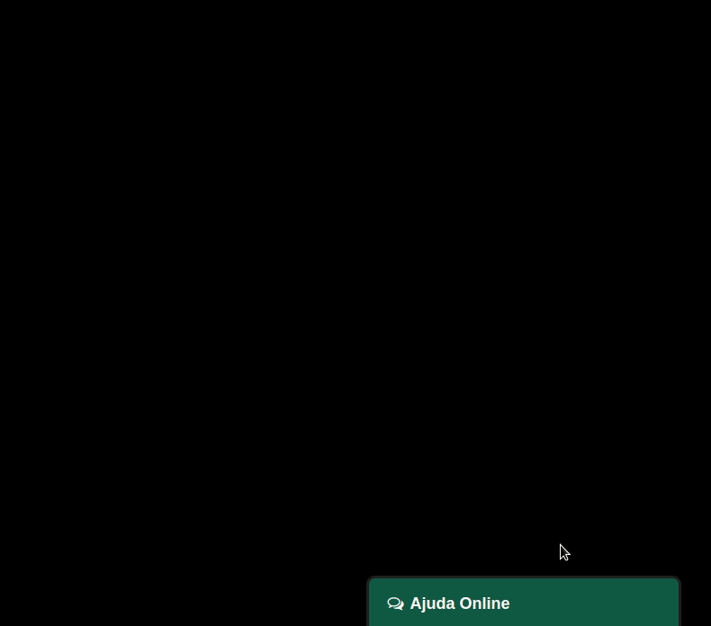

<div align="center" id="top"> 
  

&#xa0;

</div>

<h1 align="center">Chat bot example</h1>

<p align="center">
  

  

  

  
  
</p>

<p align="center">
  <a href="#dart-about">About</a> &#xa0; | &#xa0; 
  <a href="#sparkles-features">Features</a> &#xa0; | &#xa0;
  <a href="#rocket-technologies">Technologies</a> &#xa0; | &#xa0;
  <a href="#white_check_mark-requirements">Requirements</a> &#xa0; | &#xa0;
  <a href="#checkered_flag-starting">Starting</a> &#xa0; | &#xa0;
  <a href="#memo-license">License</a> &#xa0; | &#xa0;
  <a href="https://github.com/wsasouza" target="_blank">Author</a>
</p>

<br>

## :dart: About

Exemplo simples de chatbot em Javascript utilizando JQuery.

## :sparkles: Features

:heavy_check_mark: Resposta automática a mensagens de saudação: bom dia, boa tarde e boa noite;\
:heavy_check_mark: Menu simples para selecionar uma opção de 1 a 4;

## :rocket: Technologies

The following tools were used in this project:

- [HTML](https://developer.mozilla.org/pt-BR/docs/Web/HTML)
- [CSS3](https://developer.mozilla.org/pt-BR/docs/Web/CSS)
- [Javascript](https://developer.mozilla.org/pt-BR/docs/Web/Javascript)
- [JQuery](https://jquery.com/)

## :white_check_mark: Requirements

Before starting :checkered_flag:, you need to have [Git](https://git-scm.com) installed.

## :checkered_flag: Starting

```bash
# Clone this project
$ git clone https://github.com/wsasouza/chat-bot-example

# Access
$ cd chat-bot-example

#run
$ Select index.html and right click select "Open with Live Server"

# The site will initialize in the <http://127.0.0.1:5500/index.html>
```

## :memo: License

This project is under license from MIT. For more details, see the [LICENSE](LICENSE.md) file.

Made with :heart: by <a href="https://github.com/wsasouza" target="_blank">Walter Santos de Andrade Souza</a>

&#xa0;

<a href="#top">Back to top</a>
